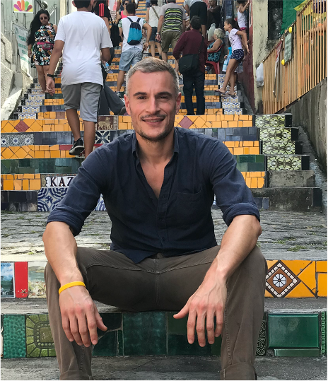

<!-- Headings -->
## Predicting brain tissue damage for stroke patients using deep supervised learning and CTP data

<!--  -->
<p align="center"></p>

### Project description
* We use computed tomography perfusion (CTP) data combined with a supervised deep learning algorithm to predict voxelwise blood-flow properties within the brain for ischemic stroke patients
* We extract features from the density/time curves of each voxel with a supervised deep learning model based on 1D convolutional layers
* We successfully apply our method on a dataset provided by the Stanford University School of Medicine and show its potential at recovering the main hemodynamic properties of the brain tissues

### Motivation
* Stroke is the leading cause of disability and the third leading cause of death in the United States (more information here). The most common type of strokes, referred to as ischemic strokes, are caused by a blockage in an artery that supplies blood to the brain. The blockage reduces the blood flow and oxygen to the brain, leading to irreversibly infarcted tissues (core) and severely ischemic, but potentially salvageable, tissues (penumbra). If circulation is not restored quickly, brain damage can be permanent. Consequently, there is a small time window (less than nine hours after the onset of the stroke) during which an accurate diagnostic must be made and therapy administered (Konstas et al. 2009).

* Currently the raw CTP datasets are processed by commercial software packages to generate perfusion parametric 3D maps (CBV, CBF, TMAX). These maps are then interpreted by a radiologist to delineate (i.e., segment) the core from the penumbra. However, these packages are not standardized (thus making the results unreliable) and expensive (thus limiting CTP’s utility).

* We propose to mitigate these issues by developing a robust supervised deep learning (DL) model, which we hope will have a profound impact on stroke imaging by (1) making the results more reliable and (2) by making the CTP technique more widely available and equitable.

* Our algorithm uses 4D CTP data as input and predicts a 3D image corresponding to the value of a hemodynamic parameter referred to as TMAX at every position (voxel) of the brain. This parameter represents the delayed arrival of the contrast bolus and guides the radiologist to accurately predict and delineate the extent of the core and penumbra. Higher TMAX values may indicate the presence of damaged tissues.


<!-- Italic -->
*This text* is in italic
_this text_ is in italic

<!-- Bold -->
**This text** is bold
__This text__ is bold

---
___

\*This text\* is bold

> This is a quote

[link to a website](www.youtube.com)
[link to a website with a title when you point cursor to it](www.youtube.com "youtube")

<!-- List -->
* Item 1
* Item 2
* Item 3
* Item 4
    * Nest item 1
    * Nest item 2

1. Item 1
1. Item 2
1. Item 3
1. Item 4
    * Nest item 1
    * Nest item 2

`<p>This is a paragraph</p>`




<!-- Github markdown -->
```bash
    npm install
    make install
```

```javascript
    function add(num1, num2){
        return num1+num2;
    }
```
```python
    def add(num1, num2):
        return num1+num2
    }
```
<!-- Tables -->
| Name | Email       |
| ---- | ----------- |
| Toto | toto@gmail.com |
| Mike | mike@gmail.com |

* [x] Task 1
* [x] Task 2
* [ ] Task 3
