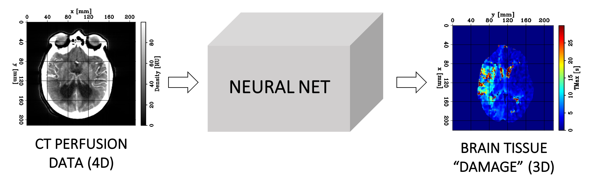

<!-- Headings -->
---
### Welcome!
Welcome to our repository where we summarize our project's main contributions and provide access to our code.

---
### Our project in a nutshell
* After a stroke, some brain tissues may still be salvageable but we have to move fast. Here, we try to improve the diagnostic/treatment process.
* Our project is entitled: "***Prediction of brain tissues hemodynamics for stroke patients using computed tomography perfusion imaging and deep learning***"

---
### Key words for this project
* Artificial intelligence, machine learning, deep supervised learning
* Computer vision
* Healthcare
* Computed tomography perfusion imaging (CTP)

---
### Project description
* We use computed tomography perfusion (CTP) data combined with a supervised deep learning algorithm to predict voxelwise blood-flow properties within the brain for ischemic stroke patients
* We extract features from the density/time curves of each voxel with a supervised deep learning model based on 1D convolutional layers
* We successfully apply our method on a dataset provided by the Stanford University School of Medicine and show its potential at recovering the main hemodynamic properties of the brain tissues

---
### Motivation
* Stroke is the leading cause of disability and the third leading cause of death in the United States (more information here). The most common type of strokes, referred to as ischemic strokes, are caused by a blockage in an artery that supplies blood to the brain. The blockage reduces the blood flow and oxygen to the brain, leading to irreversibly infarcted tissues (core) and severely ischemic, but potentially salvageable, tissues (penumbra). If circulation is not restored quickly, brain damage can be permanent. Consequently, there is a small time window (less than nine hours after the onset of the stroke) during which an accurate diagnostic must be made and therapy administered (Konstas et al. 2009).

* Currently the raw CTP datasets are processed by commercial software packages to generate perfusion parametric 3D maps (CBV, CBF, TMAX). These maps are then interpreted by a radiologist to delineate (i.e., segment) the core from the penumbra. However, these packages are not standardized (thus making the results unreliable) and expensive (thus limiting CTP’s utility).

* We propose to mitigate these issues by developing a robust supervised deep learning (DL) model, which we hope will have a profound impact on stroke imaging by (1) making the results more reliable and (2) by making the CTP technique more widely available and equitable.

* Our algorithm uses 4D CTP data as input and predicts a 3D image corresponding to the value of a hemodynamic parameter referred to as TMAX at every position (voxel) of the brain. This parameter represents the delayed arrival of the contrast bolus and guides the radiologist to accurately predict and delineate the extent of the core and penumbra. Higher TMAX values may indicate the presence of damaged tissues. Our proposed workflow can be summarized by the following schematic diagram:

---
### Data and pre-processing steps
* Our dataset was provided by the Stanford School of Medicine and contains CTP data for approximately 400 anonymous stroke patients, stored under the DICOM format.
* For each patient, it includes 55 3D CT images of the head acquired sequentially during the perfusion process with an acquisition sampling rate ranging from 0.5 s to 3 s.
* Each 3D image contains 10 axial slices of 512 x 512 pixels, representing the raw output of the scan.
* The vertical and horizontal samplings are 10 mm and 4 mm, respectively.
* In addition, the TMax 3D maps computed by RAPID are provided in a similar structure, but each axial slice is composed of 256 x 256 pixels, sampled at 8 mm.
* Unfortunately, the **data are not publicly available**, but please contact us for more information.
* The scripts for the pre-processing steps can be found in **python/CT_utils.py** and **python/CTP_convertDCM.py**

---
### Training process
The main code base is located within the **python** folder, and the commands to run the programs can be found in the **makefile** folder. Our numerical optimization code is implemented using the PyTorch open source machine learning library based on the Torch library:
1. **CTP_main.py** and **CTP_train.py** contain the optimization workflow
2. **CTP_models.py** contains the 8 different neural network architectures tested throughout our analysis
3. **CTP_utils.py** implements other useful functions such as loading/saving results, GPU memory management, etc.
4. **CTP_config.py** is where we set our default parameters for the optimization process.

---
### The team
* <a href="https://www.linkedin.com/in/guillaume-barnier/" target="_blank">Guillaume Barnier</a>
* <a href="https://www.linkedin.com/in/ettore-biondi/" target="_blank">Ettore Biondi</a>
* <a href="https://www.linkedin.com/in/greg-forbes/" target="_blank">Gregory Forbes</a>
* <a href="https://profiles.stanford.edu/elizabeth-tong" target="_blank">Elizabeth Tong</a> (Principal Investigator)
